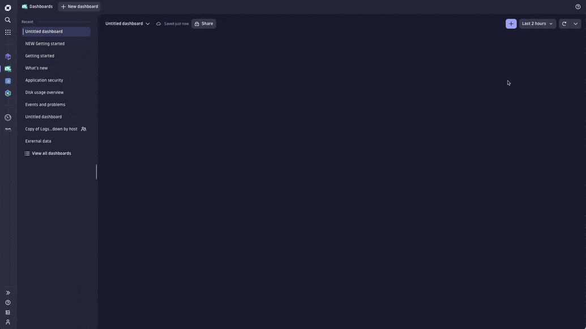

# Challenge 05 - Grail - Dashboards & Notebooks  - Coach's Guide 

[< Previous Solution](./Solution-04.md) - **[Home](./README.md)** - [Next Solution >](./Solution-06.md)

## Notes & Guidance

## Detailed Steps

### Dashboards
* Open the Dashboards app from the Left Menu
* Select + Dashboard
* Select + to add dashboard element
* Select Query Grail


* In the tile editor for Query, enter the following DQL
```bash
    fetch logs
    | filter cloud.provider == "azure"
    | summarize count(), by:{azure.resource.type}
    | sort `count()`, direction:"descending"
```
* Select Run Query. For logs, your results will be generated in a table by default.
* Select Select visualization tab to display the results differently. image


### Notebooks to analyze log data

* Download this sample notebook we will use to analyze logs
    - Right click in browser, click Save As
    - Click on [this link](https://raw.githubusercontent.com/dt-alliances-workshops/azure-modernization-dt-orders-setup/grail/learner-scripts/AzureGrailWorkshop-Logs.json) to download the file.
        
* Go into Dynatrace UI, open the notebooks app from your left menu
    
* Expand the Notebooks menu
    
* Click on upload and browse to the notebook JSON file where you saved.
* Follow the instructions in the notebook to analyze log data from a Hipster shop sample app.

### Notebooks to analyze metric data
* Download this sample notebook we will use to analyze logs
    - Right click in browser, click Save As
    - Click on [this link](https://raw.githubusercontent.com/dt-alliances-workshops/azure-modernization-dt-orders-setup/grail/learner-scripts/AzureGrailWorkshop-Metrics.json) to download the file.
        
* Go into Dynatrace UI, open the notebooks app from your left menu
    
* Expand the Notebooks menu
    
* Click on upload and browse to the notebook JSON file for Metrics where you saved.
* Follow the instructions in the notebook to analyze Azure  metrics for your hosts.