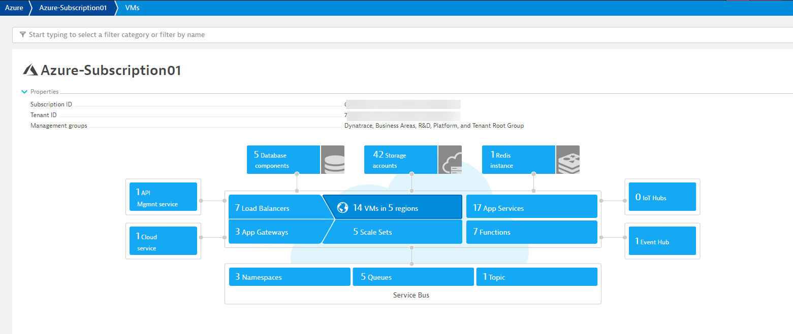
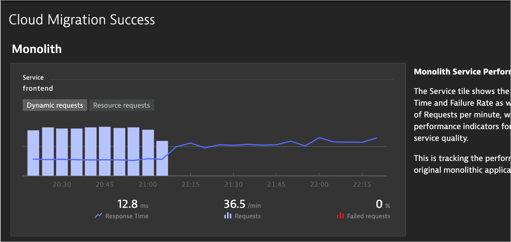

# Challenge 04 - Azure Monitor Metrics & Custom Dashboard 

[< Previous Challenge](./Challenge-03.md) - **[Home](../README.md)** - [Next Challenge >](./Challenge-05.md)

## Introduction

In addition to monitoring your Azure workloads using OneAgent, Dynatrace provides integration with Azure Monitor which adds infrastructure monitoring to gain insight even into serverless application scenarios.

Dynatrace enhances the data from Azure Monitor by adding additional metrics for cloud infrastructure, load balancers, and API Management Services, among others. These metrics are automatically managed by Dynatrace's AI engine, improving operations, reducing MTTR, and fostering innovation.

Here is an example from another environment on Azure Monitor screen looks like:

## Description

### Objectives of this Challenge
- Review how Dynatrace integrates with [Azure monitor](https://www.dynatrace.com/support/help/how-to-use-dynatrace/infrastructure-monitoring/cloud-platform-monitoring/microsoft-azure-services-monitoring/set-up-azure-monitoring)

- Examine Dynatrace Service Level Objectives (SLOs)

- Create a custom dashboard with SLOs

### Tasks

1. From the left side menu in Dynatrace, click the Azure menu item. Scroll down, and in the Environment dynamics action click on the region to open the virtual machine regional page
    - How many Virtual Machine's exist in your region?
    - How many VM Scale sets exist in this subscription?
1. Create an SLO Dashboard and call it "Cloud Migration Success"
    - From the left side menu in Dynatrace, pick the dashboard menu.
    - On the dashboard page, click the new dashboard button. Give the dashboard a name of "Cloud Migration Success"
    - On the blank dashboard page, click the settings. Then click the advanced settings link to open then settings page
    - On the settings page, click the dashboard JSON menu.
    - Copy and paste the following Json content from this file into your dashboard JSON, replacing the existing JSON in the process: [Dashboard JSON file link](https://raw.githubusercontent.com/dt-alliances-workshops/azure-modernization-dt-orders-setup/master/learner-scripts/cloud-modernization-dashboard.json)
        - **Note:** You MUST replace the owner field to be the email that you logged into Dynatrace with or you will not be able to view it.
    - After you edit the email, then click the Revert Dashboard ID button. After you click the Revert Dashboard ID button, click the Save changes button.
1. Edit the dashboard and adjust the tiles with the SLOs and databases in your environment. Repeat the same steps above for the Cloud services tile, but pick the staging- frontend in the Service properties window
    
    

## Success Criteria

- Cloud Migration dashboard shows SLO data for frontend service on monolith and kubernetes
- Azure dashboard under Infrastructure -> Azure shows Azure monitor metrics.

## Learning Resources
 - [Monitor Azure Services with Azure Monitor Metrics](https://www.dynatrace.com/support/help/setup-and-configuration/setup-on-cloud-platforms/microsoft-azure-services/azure-integrations/azure-monitoring-guide)
 - [Azure Cloud Services enabled with Azure monitor integration](https://www.dynatrace.com/support/help/setup-and-configuration/setup-on-cloud-platforms/microsoft-azure-services/azure-integrations/azure-cloud-services-metrics)
 - [Default Azure Metrics enabled](https://www.dynatrace.com/support/help/setup-and-configuration/setup-on-cloud-platforms/microsoft-azure-services/azure-integrations/azure-monitoring-guide/azure-metrics)
 - [Instructions to create dashboards are located here](https://www.dynatrace.com/support/help/how-to-use-dynatrace/dashboards-and-charts/dashboards/create-dashboards)

## Tips

## Advanced Challenges (Optional)

Too comfortable?  Eager to do more?  Try these additional challenges!

